# Athol Fugard

Athol Fugard is the unofficial website of Athol Fugard, the South African playwright, novelist, actor, and director, widely regarded as South Africa's greatest and most influential playwright. The target audience is the older and younger readers who are interested in apartheid and post-apartheid South Africa and its literature. And goal of the website is to let them know more about Athol Fugard: his life, his protest theatre, and his significant contribution to the struggle of the oppressed black South Africans for freedom. Fugard’s contribution to South African theatre is made more pronounced by the fact that he is white and had sacrificed this privileged position to side with and fight for the oppressed. 

  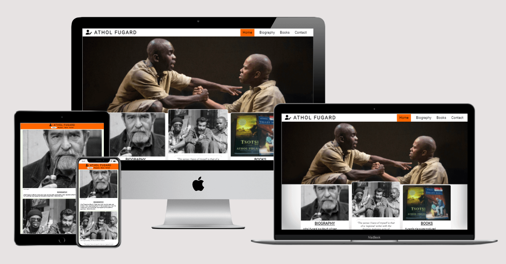

[Click here to view Live Project Here](https://panzek.github.io/portfolio1-athol-fugard/)

## Table of Contents
* [Introduction](#introduction)

* [UX - User Experience Design](#UX-user-experience-design)
    * [User Stories](#user-stories) 
    * [Design](#design)
    * [Color Scheme](#color-scheme)
    * [Typography](#typography)
    * [Wireframes](#wireframes)

* [Features](#Features)
    * [Existing features](#existing-features)
        * [Header](#header)
            - [Logo and Title](#logo-and-title)
            - [Navigation menus](#navigation-menus)
        * [anding page hero image](#landing-page-hero-image)
        * [Card Section](#card-section)
        * [Footer](#footer)
        * [Books Page](#books-page)
        * [Contact Page](#contact-page)
        * [Hidden Pages](#hidden-pages)

* [Technology Stack](#technology-stack)
    * [Languages Used](#languages-used)
    * [Frameworks, Libraries, and Programs Used](#Frameworks-libraries-and-programs-used) 

* Testing
    * [Validator Testing](#validator-testing)
    * [Accessibility Testing](#accessibility-testing) 

* [Fixed Bugs}(#fixed-bugs)
    * [Reported](#reported) 
    * [Resolved](#resolved)

* [Deployment](#deployment)
* [Credits](#credits)
    * [content](#content)
    * [Media](#media)
    * [Acknowledgements](#acknowledgements)

## User Experience (UX)
* User Stories 
    * As a user, I want to see navigation menus so that I will be able to access the website from any page.
        * The header contains the navigation menus. It is fixed to the top of the page and makes it for you to navigate to any of the pages.
    * As a user, I want to see an Author biography page so that I can know more about Athol Fugard, his writings, and his contribution to apartheid and post-apartheid South African drama.
        * The Biography page contains a brief information about Athol Fugard and his writings. There is also his personal photograph to put a face to the name.
    * As a user, I want to see a book gallery page of Fugard’s titles so that I will be able to choose any of his books I may want to buy.
        * The Book page is a gallery of selected covers of books published by Athol Fugard. Each book cover has a link to Amazon, an online store where you can read the book description and possibly buy it.
    * As a user, I want to see a contact page so that I will be able to send a message to make enquiries.
        * The contact page shows how you can communicate with Athol Fugard. However, the form is for illustration purpose; it does not have the required language to collect your personal information that you provide or send your message.
    * As a user, I want to be able to sign up to a mailing list so that I can receive news and announcements related to Athol Fugard.
        * The newsletter form is on the footer of every page. It shows how you can subscribe to receive news and information about Athol Fugard.  Like the contact form, the signup form is also for illustration purpose. It does not have the required language to collect your information or sign you up. 

* Design
    * Color Scheme
        * orange (#ff6d00)
        * green (#2e7d32)
        * white (#fff)
            * The colors selected for this website are **orange (#ff6d00)**, **green (#2e7d32)**, and **white (#fff)**. These colors are carefully chosen for three reasons: 
            * First, to depict other part of Athol Fugard’s heritage and identity that is given fleeting or no attention at all. **Fugard is a South African with an Irish blood**; his father was originally from Ireland. This website’s orange, green, and white colors are the tricolor of the national flag of Ireland and symbolise Fugard’s bloodline connection to Ireland.
            * Second, the tricolor, like the Irish flag, intends to also symbolise the “aspiration for unity between people of different colors and traditions” in South Africa, which is the thematic concern of Fugard’s oeuvre. 
            * Third, the application of the tricolor to the website is for aesthetic nourishment: to make the website look beautiful in a way that it speaks creatively to all visitors. For this reason, in their visual application to the website, the three colors are not of equal size or in the same order as would be found in the Irish flag. Orange (#ff6d00) is taken as the website’s main color and green (#2e7d32) and white (#fff) are its secondary colours, with other tint colors from green and orange family as inspirational alternatives. Black (#000) color, whenever it is found on the website either as a background or font color is treated as a default color. 
            * In sum, the site’s color scheme affirms Fugard’s identity, negotiates elegant style, and intends to please and delight the website visitor.
            * In other not to sacrifice WCAG 2.0 criteria in the altar of functional needs, care was taken to check color values for accessible contrast using [EightShapes’]( https://contrast-grid.eightshapes.com/) color contrast grid tool. 

           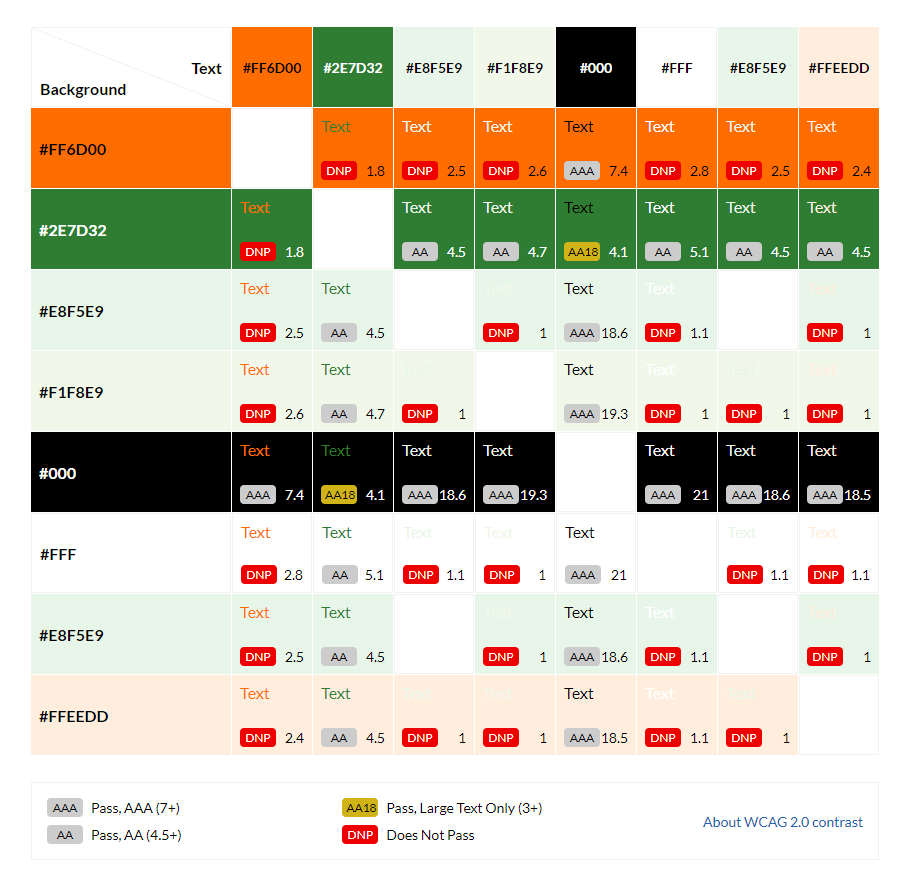

    * Typography
        * [Roboto](https://fonts.google.com/specimen/Roboto)
        * Sans-serif
            * The main font used for the website is [Roboto](https://fonts.google.com/specimen/Roboto) with sans-serif as the fallback. Friendly and straightforward in appearance, Roboto is a “neo-grotesque” sans-serif typeface family. To keep things simple and clean, Roboto is the only font used throughout the website, but with font weights of bold 700 for headings and lower headings and thin 100 for body text. The beauty of Roboto is that it is modern, contemporary, minimalistic, readable, and serves well for a writer’s website.

     * Wireframes
        * The wireframes were created using [Balsamiq](https://balsamiq.com/). And they were designed for mobile, tablets, and desktop. 
            * Mobile

        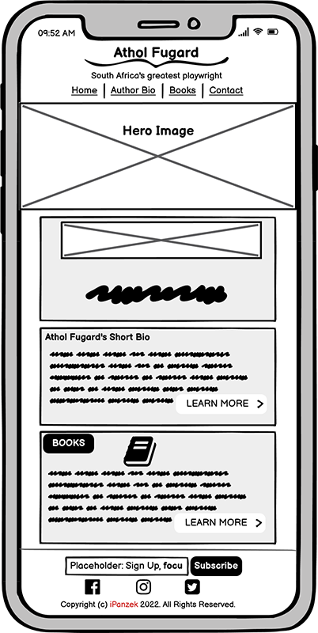

        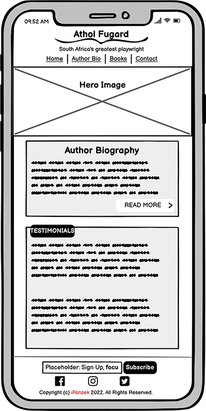

        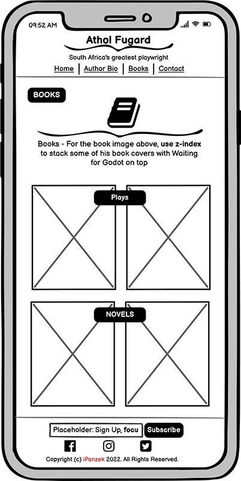

        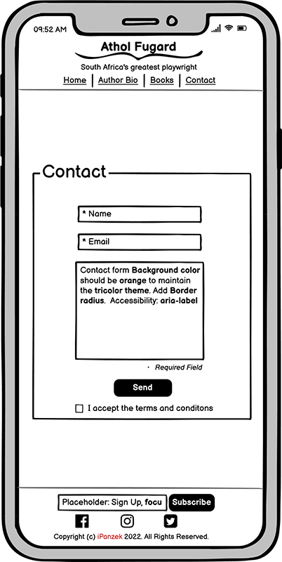
       

        * Desktop

        
        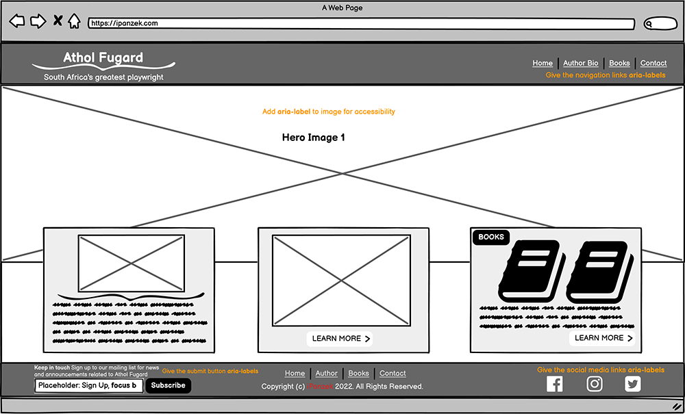

        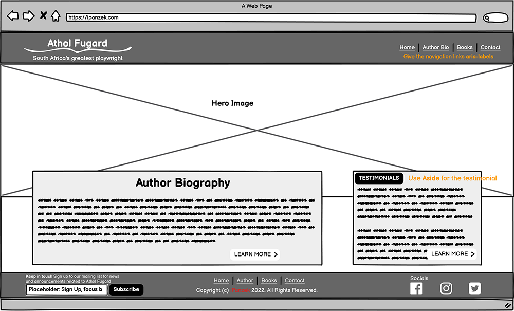
        
        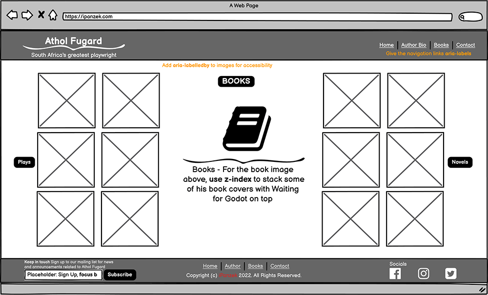

        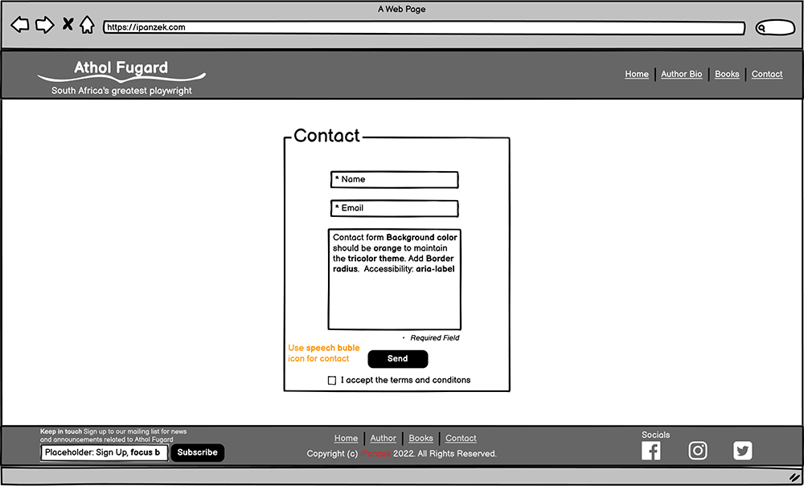

        

        * In implementation, there was need to make the following changes to the initial concepts:
            * The book page on mobile was reconfigured to take one book cover instead of two to improve the User Experience.
            * On Biography page for both mobile and desktop, the testimonial text content was replaced with “Milestones”, a wrapper containing Fugard’s Bio Data, Notable works, and Selected Awards, which enables the implementation of HTML5 details and summary for user interaction. These semantic elements enhance user experience because they allow the expansion and collapsed of content by the user interaction. 
            * On Contact page for both mobile and desktop also, extra input field for first name was added and the input field that was for full name now serves as last name field.  

## Features
* Existing Features 
    * Header
        * Logo and Title
            * The logo is a Font Awesome user-pen icon carefully chosen to represent a writer. And the title is the name of the playwright.
            * The logo and title have an implicit link to the homepage, following a long-standing web convention and for fluid user experience.

            

        * Navigation
            * Navigation bar has four links arranged horizontally in order of priority of information and features: Home, Biography, Books, and Contact menus. 
            * Active menu is highlighted in orange color on desktop (on mobile, the background of the navigation bar is orange and the active menu is highlighted in white color) to show the page the user is currently viewing. The menus, except the active menu, are underlined on hover. Image below shows that the user is viewing the biography page on desktop. (The image after that shows that the user is viewing the homepage on mobile or small tablet.)
            
            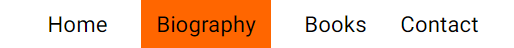

            * Menu items let the reader to easily navigate the website without having to rely on the browser’s “forward” and “back” arrows as navigation substitutes.

     * Logo, title, and Navigation
        * On mobile devices and small tablets, the logo and title sit above the navigation menu in a vertical position in the header.

        

        * On desktop and larger tablets, the logo and title are aligned on the far-left hand side of the page header and Navigation menus are on the far-right hand side of the page header in a horizontal position in the header. 

        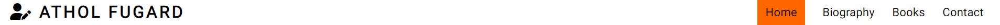

    * This Full responsive header with logo and title, and navigation menus is fixed and consistent across in all four pages (plus the two “hidden” pages) of the website to allow for easy navigation. 

    * The landing page hero image
        * The landing includes a hero image of a stage production of one of Athol Fugard’s notable works, The Island (devised with John Kani and Winston Ntshona, 1973), with text overlay to explain to the reader what the image is all about and where it was taken. The play is set in Robben Island, South Africa’s notorious prison where Nelson Mandela was caged for 27 years, with two black political prisons, Kani and Ntshona, sentenced to life with hard labour. The play “sets out to show that humanity, honour, and dignity can survive in the most horrific circumstance.” 
        * Handling the hero images on the homepage and contact pages, I use the <picture> element “art direction” - a technique of changing “image displayed to suit different image display sizes.” I created 3 image files of different picture and sizes for different viewport widths: *The Island* stage production picture and Fugard group photo with John Kani and Winston Ntshona serve viewport of 1024px wide or higher and landscape view larger tablets. Fugard’s personal photo serves portrait-view mobile devices and small tablets. 
        * Also, I use the WebP image formats to maintain both a low file size and high-quality of the hero images and all other images on the website. 

        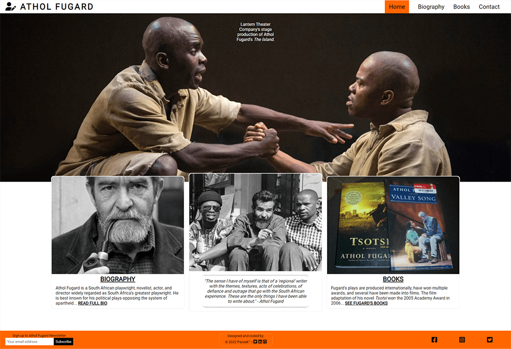

    * Card Section
        * The card section is the content section that introduces the reader to the relevant sections of the website takes a **progressive disclosure** approach, by revealing to the user what is in the biography and book gallery pages intended and encouraging them to go further beyond the homepage to create fluid user experience. The card section is split into three areas: Biography, Fugard’s photo, and Books sections, with relevant supporting image for each section. 
        * The first sub-section section is a short biography of Fugard with a “read more” link to the full biography page. It includes Fugard’s personal photo to put a face to it. 
        * There is also the image of Fugard with John Kani and Winston Ntshona on the second sub-section to maintain consistency with the theme in the hero image. *The Island* was devised by Fugard, Kani, and Ntshona. Also, Fugard collaborated with both men on other landmark productions such as *Sizwe Bansi Is Dead*. 
        * The third sub section of the card section contains introduces the user with a summary of Fugard’s writing with the image of his two books covers. The Bio and Books sub-sections included links that user will click to navigate to these pages.
        * The card section is structured in such a way that it attempts to enable a visitor on the website to immediately ascertain who Fugard is, what he writes about, who were his major collaborators, and, more importantly, let the user easily access the information that interest them and also encourage the user to want to read Fugard’s books, go watch his plays on stage, and possibly buy his books. The tricolor structure of the card section is maintained throughout the page for intuitiveness and consistency.

    * Footer
        * The footer section is split into 3 sections. One, a mailing list sign-up form that allows and encourages the user to subscribe to receive information related to Athol Fugard and his books. To keep it simple and encouraging, the user is required to submit email address only. Two, is the copyrights section that includes my social media links so that recruiters and collaborators can connect with me.
        * The footer section includes links to three relevant social media accounts: Facebook, Instagram, and Twitter. The social networks links communicate with users and encourage them to keep connected with Athol Fugard via social media. The links will open to a new tab to allow easy navigation for the user.
        * The footer like the header is consistent across the pages for easy navigation and intuitive experience. The header section, the main content, and the footer section.

        

    * Biography Page
        * Card feature area of the biography page is split into 3 sections to maintain consistency with the homepage. Section 1 contains Fugard’s full biography. Section 2 is his personal photo and one of his quotes. And section 3 contains an analysis of his writings. Inside this section is an aside for Fugard’s milestones: biodata, notable works, and selected awards.

        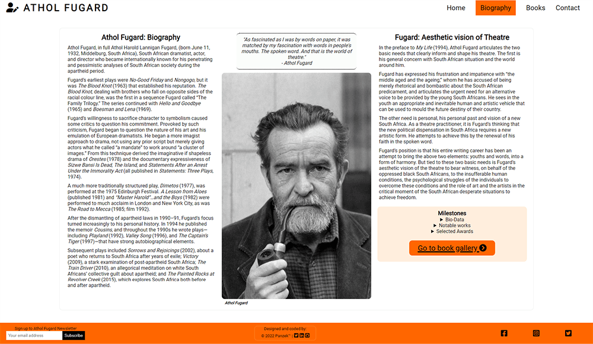

    * Books Page
        * The book gallery provides the user with covers of some of Fugard’s books. And each book cover has a link to [Amazon](https://panzek.github.io/portfolio1-athol-fugard/).
        * This link is valuable to the users as they will be able to visit an online store where they can see the book description and possibly buy the book.
        * Quality of some of these book covers are not high resolution, which appears to slightly compromised image quality. However, they are the best quality available on the internet, and it requires that only Fugard’s book covers for this illustration. 

        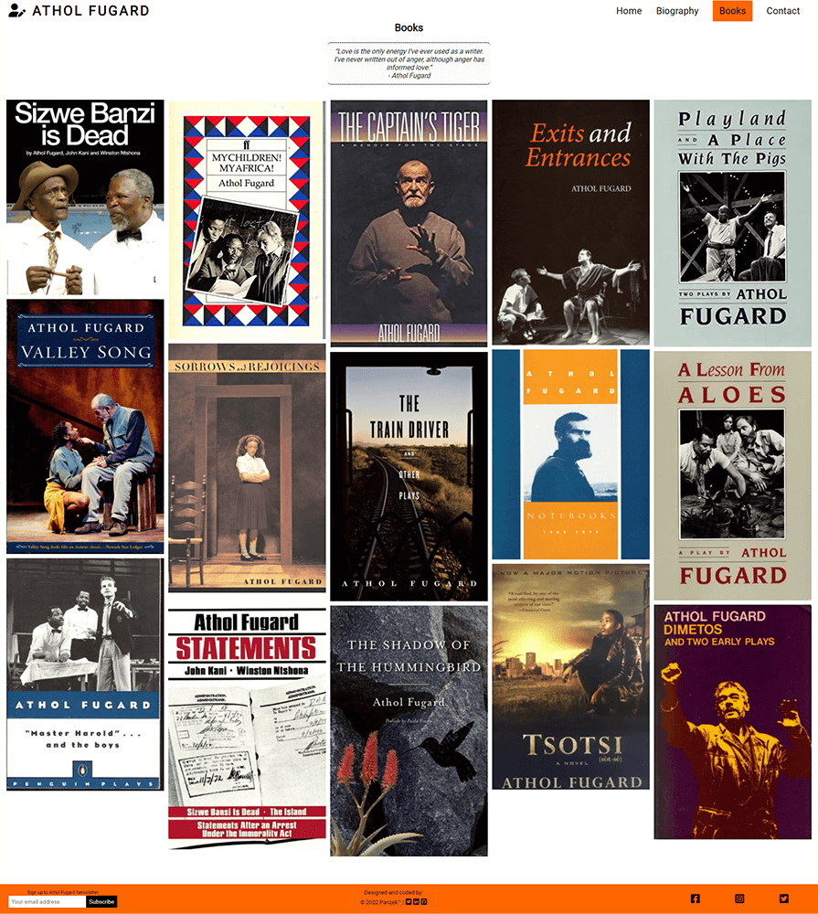

    * Contact Page
        * This page encourages the user to get in touch for questions on Fugard’s speaking or books-signing events and to request copyrights permission to use his books. The form is kept simple and clear without much information being requested from the website user, only the first name, last name, email address, and message. Terms and conditions button that the reader must check before the form can be submitted is included to provide clarity on the terms in which the information being provided by the user will be processed and used. It also helps to prevent site abuse.

        

## Technology Stack
* Languages Used
    * [HTML5]( https://developer.mozilla.org/en-US/docs/Glossary/HTML5)
    * [CSS3]( https://developer.mozilla.org/en-US/docs/Web/CSS)

* Frameworks, Libraries, and Programs Used 
    * [Font Awesome](https://fontawesome.com/)
    * [Git](https://git-scm.com/)
    * [GitHub](https://github.com/)
    * [Gitpod](https://www.gitpod.io/)
    * [Google Chrome DevTools](https://developer.chrome.com/docs/devtools/) 
    * [Google Fonts](https://fonts.google.com/)
    * [Material Design](https://material.io/resources/color/#!/)

## Testing
* Validator Testing
    * [W3C Markup Validator](https://validator.w3.org/) was used to check the markup validity of the HTML5 for technical quality and correctness, and no errors found.

     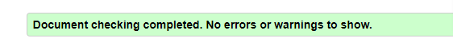

    * [W3C CSS Validation Service](https://jigsaw.w3.org/css-validator/) was used to check the markup validity of the CSS3 for technical quality and correctness, and no errors found.

    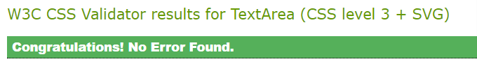

    * [BrowserStack](https://www.browserstack.com/) was used to test the site on different browsers and real mobile devices.
    * [Responsinator](https://www.responsinator.com/) was used to test the site on real mobile devices.

* Accessibility Testing
    * [Accessibility Insights](https://accessibilityinsights.io/) was used to check and fix accessibility issues.
    * [Lighthouse](https://developers.google.com/web/tools/lighthouse) - used to test accessibility.

* Fixed Bugs:
    * [Accessibility Insights]( https://accessibilityinsights.io/) detected insufficient color contrast of 2.93 between foreground and background colors of button in milestones area of the Biography page. 

    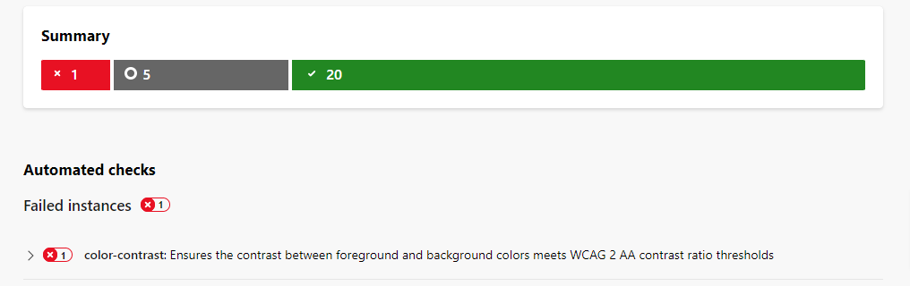

    * Fixed issue by changing the link text from white to black color.

    * Chrome's Lighthouse detected that a background image displayed with incorrect aspect ratio. 
        * Fixed the issue by changing the displayed aspect ratio from 153 x 113 (incorrect ratio) to 1099 x 828 (correct ratio).

    * Thereafter, I ran a final check through Chrome's lighthouse audit service, and it returns the reports below: 

    * Mobile
    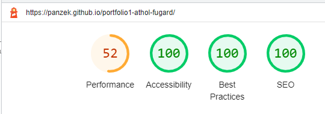

    * Desktop
    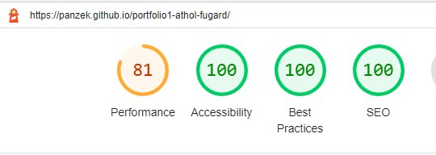

## Deployment 
* The website was deployed to GitHub Pages. These were the steps taken for the deployment:
    1. Log in to [GitHub](https://panzek.github.io/portfolio1-athol-fugard/)
    2. Click on the profile icon at the top right-hand site of the page
    3. On the dropdown menu, click **'Your repositories'**.
    4. On the repository page, click on the repository you want to deploy.
    5. At the top of the repository, locate the **'Settings'** link and click.
    6. On the left-hand side navigation bar of the Settings page, click **'Pages'** 
    7. On the GitHub Pages page, under **'Source'** click **'Main'** then click **'Save'**.
    8. Refresh the page and the live link is ready in a few minutes.

    [View Live Project Here]( https://panzek.github.io/portfolio1-athol-fugard/)

## Credits
* Content
    * The website: 
        * Roboto font was taken from [Google Fonts](https://fonts.google.com/specimen/Roboto)
        * The font size clamp values saved into the CSS Pseudo root (:root) level of the external CSS file were calculated and generated from [Utopia](https://utopia.fyi/type/calculator/) 
        * [W3 Schools](https://www.w3schools.com/), [Stackoverflow](https://stackoverflow.com/), and [MDN Web Docs](https://developer.mozilla.org/), all provided the code resource.
        * [HTML & CSS Coding Best Practice](https://medium.com/@inceptiondj.info/html-css-coding-best-practice-fadb9870a00f) for code standardisation. 
        * [How Flexbox works - explained with big, colorful, animated gifs](https://www.freecodecamp.org/news/an-animated-guide-to-flexbox-d280cf6afc35/) provided and inspired flexbox ideas and techniques that frame the website.
        * Fugard’s quotes were taken from [Athol Fugard Quotes](https://www.goodreads.com/author/quotes/7770.Athol_Fugard)
        * [Code Institute](https://codeinstitute.net/) lectures and “Love Running” sample project help shape the ideas and techniques that frame this Portfolio Project 1 for [Diploma the Full Stack Software Development](https://codeinstitute.net/ie/full-stack-software-development-diploma/).
        * [Responsinator](https://www.responsinator.com/) was used to check how the site will look on the most popular devices.
        * [Techsini](http://techsini.com/multi-mockup/index.php) was used to generate the website mockup.
        * [CSS Color Converter](http://maettig.com/?page=PHP/CSS_Color_Converter) was used to convert colors.
        * All jpeg and png images used in this project were first compressed using [TinyPng](https://tinypng.com/) and then converted from jpeg or png to webP using [Convertio](https://convertio.co/).

    * Homepage: 
        * Biography text was taken from [Wikipedia](https://en.wikipedia.org/wiki/Athol_Fugard). 
        * Book short introduction text was taken from [Britannica](https://www.britannica.com/biography/Athol-Fugard).
    
    * Biography Page: 
        * Text for the section “Athol Fugard: Biography” was taken from <link>. 
        * Text for the section, “Fugard: Aesthetic Vision of Theatre” is an excerpt from my PhD Thesis, **Literary Aesthetics of Modern South African Drama** (Dept. of English, University of Lagos, 2014). 
        * The text for “Milestones” was taken from [Wikipedia]( https://en.wikipedia.org/wiki/Athol_Fugard).

    * Book Page: 
        * Text description for each of the book covers was randomly excerpted from reviews relevant to book, sourced from the internet.  
        * Footer: 
        * Social media icons were taken from [Font Awesome](https://fontawesome.com/)
        * Thank-You Email Newsletters was taken from [Medium]( https://medium.com/tips-and-tricks-about-online-forms/5-thank-you-messages-to-use-on-your-web-forms-32c18f00426c)

    * Contact Page: 
        * Contact form “Thank You” Message was taken from [Medium](https://medium.com/tips-and-tricks-about-online-forms/5-thank-you-messages-to-use-on-your-web-forms-32c18f00426c)

    * README: 
        * Color Scheme in Design section: Quotation and the general idea about the import of the Irish flag was taken from [National Flag of Ireland](https://www.gov.ie/en/publication/adc448-the-national-flag/) 
        * Landing Page Hero Image section: Quotation was the words of Philip Fisher in [British Theatre Guide]( https://www.britishtheatreguide.info/reviews/theisland-rev)
        [Medium]( https://medium.com/tips-and-tricks-about-online-forms/5-thank-you-messages-to-use-on-your-web-forms-32c18f00426c)

* Media
    * Homepage: 
        * Hero image was from [Exeunt Magazine](http://exeuntmagazine.com/reviews/the-island/). 
        * Fugard’s personal photo was from [IMDb](https://www.imdb.com/name/nm0297538/mediaviewer/rm2364570112/). 
        * Group photo with Athol Fugard, John Kani, and Winston Ntshona was from [Britannica](https://cdn.britannica.com/04/68004-050-3CF39874/Athol-Fugard-actors-John-Kani-Winston-Ntshona-1973.jpg). 

    * Book gallery page: 
        * Book covers were sourced and picked randomly from Google](https://www.google.com/search?q=athol+fugard)

    * All Images: 
        * [Convertio](https://convertio.co/) was used to convert the images from jpeg to webp format.
        * [Tinypng](https://tinypng.com/) was used to reduce the WEBP file size.

* Acknowledgements
    * [Akshat Garg](https://github.com/akshatnitd), my [Code Institute](https://github.com/Code-Institute-Org) mentor, for his patience and care, and for being awesome with his supervision.
    * To Student care team for reaching out and checking that I was getting on well with the course.
    * To all those who contributed to different discussions in Slack, especially “Project Portfolio 1”, “Peer Code Review”, and 2022 Cohort Class channels that I visited regularly. Your numerous questions, answers to those questions, and comments on wide range of coding concerns provided insights, pointers, and motivation.
